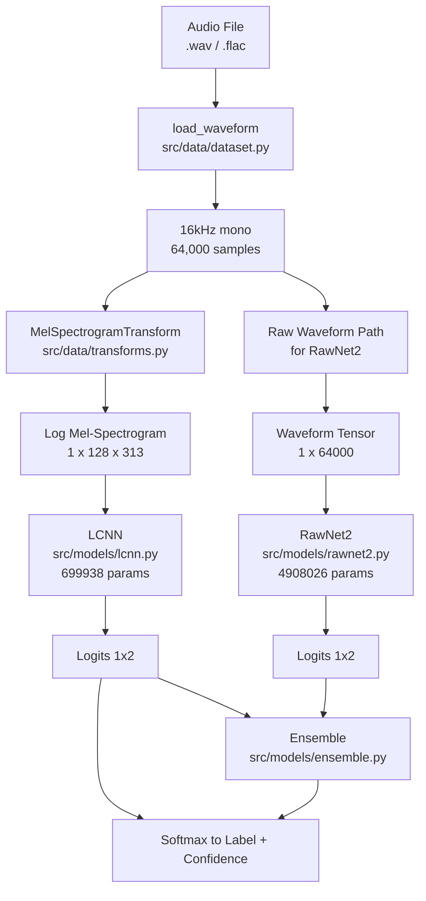

# Audio Deepfake Detector

> Detect AI-generated speech with a Light CNN trained on ASVspoof 2019 LA — achieving **7.07% EER**, beating the LFCC-GMM baseline of 8.09%.

[](https://www.python.org/)
[](https://pytorch.org/)
[](https://fastapi.tiangolo.com/)
[](https://gradio.app/)
[](LICENSE)

**Demo:** [Hugging Face Spaces — coming soon](#) | **Docs:** [`docs/`](docs/)

---

## Overview

This project trains and evaluates two neural architectures for **countermeasure (CM)** systems against text-to-speech and voice-conversion spoofing attacks, as defined by the ASVspoof 2019 Logical Access (LA) challenge. The system answers one question: **is this audio clip real human speech or AI-generated?**

Two complementary approaches are explored:

- **LCNN** — a Light CNN operating on log mel-spectrograms that detects spectral artifacts left by vocoders
- **RawNet2** — an end-to-end model with learnable sinc filters that operates directly on raw waveforms

The final deployed model is LCNN with **7.07% EER** on the held-out evaluation set, outperforming the published LFCC-GMM baseline of 8.09%.

---

## Results

### Overall EER Comparison

| Model | Dev EER | Eval EER | vs. Baseline |
|---|---|---|---|
| LFCC-GMM Baseline | — | 8.0900% | — |
| **LCNN (ours)** | **0.0000%** | **7.0724%** | **-1.02 pp** |
| RawNet2 (ours) | 2.4700% | 12.7814% | +4.69 pp |
| Ensemble (average) | — | 10.2392% | +2.15 pp |
| Ensemble (learned LR) | — | 9.9167% | +1.83 pp |

Lower EER is better. Baseline from the ASVspoof 2019 paper (Todisco et al., 2019).

### Per-Attack EER — LCNN on Eval Set

| Attack | EER (%) | Difficulty | Notes |
|---|---|---|---|
| A07 | 0.0000 | Easy | Vocoder artifacts at high freq — perfect detection |
| A08 | 0.8158 | Easy | Traditional waveform concatenation |
| A09 | 0.1224 | Easy | Waveform filtering — slight low-freq artifacts |
| A10 | 0.5846 | Easy | NN-based TTS |
| A11 | 0.3663 | Easy | Transformer TTS |
| A12 | 0.7750 | Easy | WaveNet vocoder |
| A13 | 0.7937 | Easy | Waveform synthesis |
| A14 | 0.5088 | Easy | Statistical parametric synthesis |
| A15 | 1.5228 | Moderate | Hybrid neural/statistical |
| A16 | 0.0000 | Easy | Waveform concatenation |
| **A17** | **36.8457** | **Hard** | Neural codec — model fails completely |
| A18 | 9.7477 | Hard | Neural codec variant |
| A19 | 0.0611 | Easy | Traditional synthesis |

A17 (36.8% EER) represents a near-complete failure — the model is barely better than random for this neural codec attack type.

---

## Architecture Overview



### LCNN Layer Shapes

```
Input [B, 1, 128, 251]
    |
ConvBlock(1->32, 5x5, pad=2)     [B, 32, 128, 251]   Conv2d + BN + MFM
MaxPool2d(2,2)                   [B, 32,  64, 125]
ConvBlock(32->32, 1x1)           [B, 32,  64, 125]   channel mixing
ConvBlock(32->32, 3x3, pad=1)    [B, 32,  64, 125]   spatial features
MaxPool2d(2,2)                   [B, 32,  32,  62]
ConvBlock(32->32, 1x1)           [B, 32,  32,  62]
ConvBlock(32->32, 3x3, pad=1)    [B, 32,  32,  62]
MaxPool2d(2,2)                   [B, 32,  16,  31]
ConvBlock(32->64, 1x1)           [B, 64,  16,  31]   expand channels
ConvBlock(64->32, 3x3, pad=1)    [B, 32,  16,  31]   compress back
MaxPool2d(2,2)                   [B, 32,   8,  15]
Flatten                          [B, 3840]
Linear(3840->160) + Dropout(0.75)
Linear(160->2)                   [B, 2]
```

### RawNet2 Layer Shapes

```
Input [B, 1, 64000]
    |
SincConv(70 filters, kernel=1024, stride=16)    [B, 70, ~4000]
BatchNorm1d(70) + LeakyReLU(0.01)
ResBlock(70->70,   stride=1)                    [B,  70, ~4000]
ResBlock(70->70,   stride=1)                    [B,  70, ~4000]
ResBlock(70->128,  stride=3)                    [B, 128, ~1333]
ResBlock(128->128, stride=1)                    [B, 128, ~1333]
ResBlock(128->256, stride=3)                    [B, 256,  ~444]
ResBlock(256->256, stride=1)                    [B, 256,  ~444]
Permute [B, time, 256]
GRU(256->1024)                                  h_n [B, 1024]
Linear(1024->2)                                 [B, 2]
```

---

## Quick Start

### 1. Install

```bash
git clone https://github.com/imsoumya18/audio_deepfake_detector
cd audio_deepfake_detector
python3.14 -m venv .venv && source .venv/bin/activate
pip install -e .
```

### 2. Download Data

Download ASVspoof 2019 LA from Kaggle:
```
https://www.kaggle.com/datasets/awsaf49/asvpoof-2019-dataset
```

Unzip into `data/` so the layout matches:
```
data/
├── ASVspoof2019_LA_cm_protocols/
│   ├── ASVspoof2019.LA.cm.train.trn.txt
│   ├── ASVspoof2019.LA.cm.dev.trl.txt
│   └── ASVspoof2019.LA.cm.eval.trl.txt
├── ASVspoof2019_LA_train/flac/
├── ASVspoof2019_LA_dev/flac/
└── ASVspoof2019_LA_eval/flac/
```

### 3. Verify Environment and Data

```bash
python scripts/check_env.py
python scripts/check_dataset.py
```

### 4. Train

```bash
# Train LCNN (~28 epochs to convergence on Apple Silicon MPS)
python scripts/train.py

# Train RawNet2 (100+ epochs recommended)
python scripts/train_rawnet2.py
```

Monitor training in real time:
```bash
tensorboard --logdir runs/
```

### 5. Evaluate

```bash
# LCNN on eval set
python scripts/evaluate.py

# RawNet2 on eval set
python scripts/evaluate_rawnet2.py

# Ensemble comparison table
python scripts/evaluate_ensemble.py
```

### 6. Grad-CAM Visualization

```bash
python scripts/run_gradcam.py
# Output images saved to notebooks/
```

### 7. Run the REST API

```bash
uvicorn api.main:app --reload
# Swagger UI: http://localhost:8000/docs
```

Test with curl:
```bash
curl -X POST http://localhost:8000/predict \
  -F "audio_file=@path/to/clip.flac"
# Returns: {"label": "spoof", "confidence": 0.9872, "scores": {"bonafide": 0.0128, "spoof": 0.9872}}
```

### 8. Run the Gradio Demo

```bash
python demo/app.py
# Opens at http://localhost:7860
```

---

## Grad-CAM Findings

Grad-CAM hooks into the last convolutional block (`model.features[9]`) of the trained LCNN to reveal which time-frequency regions drove each prediction.

### Summary of Findings

| Input type | Activation region | Interpretation |
|---|---|---|
| Bonafide speech | Very low frequencies (0–1 kHz), low magnitude | Model checks *absence* of high-freq artifacts |
| A07 spoof (0% EER) | High frequencies (4–8 kHz), strong | Vocoder aliasing artifacts — clearly detectable |
| A17 spoof (36.8% EER) | Mid-low frequencies, diffuse, weak | Model has no learned signal for neural codecs |
| A18 spoof (9.7% EER) | Similar to A17, slightly more signal | Partially detectable but not reliably |

**Key insight:** LCNN learned a vocoder-specific detector, not a general speech-authenticity detector. It checks for the characteristic high-frequency spectral artifacts that 2017–2019 era neural vocoders leave behind. Neural codec attacks do not produce these artifacts, so the model is effectively blind to them.

---

## Failure Analysis: A17 and A18

### Why These Attacks Break the Model

| Property | Vocoder attacks (A07–A16) | Neural codec attacks (A17–A18) |
|---|---|---|
| Generation method | Statistical/neural vocoders | End-to-end neural audio codecs |
| Spectral artifacts | High-frequency aliasing, unnatural harmonics | Distributed across full spectrum |
| Phase coherence | Often incoherent at high freq | Highly coherent |
| Perceptual quality | Moderate to high | Very high (near-indistinguishable) |
| LCNN Eval EER | 0.0% to 1.5% | 9.7% to 36.8% |

### Root Cause

The training set (A01–A06) contains only vocoder-based attacks generated with 2015–2018 TTS systems. The model learned features specific to those generation pipelines. Neural codec attacks (A17–A18) were deliberately withheld from training and placed in the evaluation set to test generalization to unseen attack families — and the model fails this test.

The ensemble did not help: both LCNN and RawNet2 fail on A17/A18, so fusing their scores produces correlated errors, not cancellations.

### Path Forward

1. Include neural codec attack samples in training (ASVspoof 2021/2024 data)
2. Use phase-aware features — neural codecs have distinctive phase patterns
3. Apply temporal coherence analysis — neural codecs have unnatural temporal smoothness
4. Train AASIST (graph attention on spectro-temporal features) — state-of-the-art as of 2022

---

## Project Structure

```
audio_deepfake_detector/
├── data/                        # Dataset (gitignored — download separately)
├── src/
│   ├── data/
│   │   ├── protocol.py          # Parse ASVspoof protocol files into DataFrames
│   │   ├── dataset.py           # ASVspoofDataset + load_waveform()
│   │   └── transforms.py        # MelSpectrogramTransform + SpecAugment
│   ├── models/
│   │   ├── lcnn.py              # LCNN with MFM activation (699,938 params)
│   │   ├── rawnet2.py           # RawNet2 with SincConv (4,908,026 params)
│   │   └── ensemble.py          # Score fusion: average + logistic regression
│   ├── training/
│   │   ├── trainer.py           # Training loop + TensorBoard + early stopping
│   │   └── losses.py            # Weighted CrossEntropyLoss computation
│   ├── evaluation/
│   │   └── eer.py               # EER + per-attack EER via sklearn + scipy
│   ├── explainability/
│   │   └── gradcam.py           # Grad-CAM with PyTorch forward/backward hooks
│   └── inference/
│       └── predict.py           # Single-file inference pipeline
├── api/
│   ├── main.py                  # FastAPI app with lifespan model loading
│   └── schemas.py               # Pydantic response models
├── demo/
│   └── app.py                   # Gradio interface with Grad-CAM overlay
├── scripts/
│   ├── train.py                 # LCNN training entry point
│   ├── train_rawnet2.py         # RawNet2 training entry point
│   ├── evaluate.py              # LCNN evaluation
│   ├── evaluate_rawnet2.py      # RawNet2 evaluation
│   ├── evaluate_ensemble.py     # All models + ensemble comparison table
│   ├── run_gradcam.py           # Grad-CAM visualization script
│   ├── check_env.py             # Verify PyTorch/MPS/torchaudio setup
│   └── check_dataset.py         # Verify dataset download and integrity
├── configs/
│   ├── lcnn.yaml                # LCNN hyperparameters
│   └── rawnet2.yaml             # RawNet2 hyperparameters
├── checkpoints/                 # Saved model weights (gitignored)
├── runs/                        # TensorBoard event logs
├── notebooks/                   # Grad-CAM output images
├── tests/                       # Unit tests
├── docs/                        # Detailed documentation (this folder)
├── pyproject.toml
└── .gitignore
```

---

## Documentation

Full deep-dive documentation is in [`docs/`](docs/):

| File | Topic |
|---|---|
| [01_problem_and_motivation.md](docs/01_problem_and_motivation.md) | Why audio deepfake detection matters, EER metric |
| [02_dataset.md](docs/02_dataset.md) | ASVspoof 2019 LA — format, splits, all 19 attack types |
| [03_architecture.md](docs/03_architecture.md) | LCNN and RawNet2 deep-dives with shapes and math |
| [04_data_pipeline.md](docs/04_data_pipeline.md) | Audio loading, mel-spectrogram theory, SpecAugment |
| [05_training.md](docs/05_training.md) | Loss, optimizer, scheduler, full training stories |
| [06_evaluation.md](docs/06_evaluation.md) | EER theory, all results, ensemble analysis |
| [07_explainability.md](docs/07_explainability.md) | Grad-CAM math, hooks, per-attack heatmap findings |
| [08_serving.md](docs/08_serving.md) | FastAPI, Gradio, Docker deployment guide |
| [09_results_and_conclusions.md](docs/09_results_and_conclusions.md) | Conclusions, limitations, future work |

---

## Stack

| Component | Library / Version |
|---|---|
| Deep learning framework | PyTorch 2.11 |
| Audio I/O | soundfile, torchaudio |
| Feature extraction | torchaudio.transforms |
| Scientific computing | numpy, scipy |
| ML utilities | scikit-learn |
| Training monitoring | TensorBoard |
| REST API | FastAPI + uvicorn |
| Browser demo | Gradio |
| Visualization | matplotlib |
| Configuration | PyYAML |
| Runtime environment | Python 3.14, Apple Silicon MPS |

---

## Citation

If you use this work, please cite the ASVspoof 2019 dataset:

```bibtex
@inproceedings{todisco2019asvspoof,
  title     = {ASVspoof 2019: Future Horizons in Spoofed and Fake Audio Detection},
  author    = {Todisco, Massimiliano and Wang, Xin and Yamagishi, Junichi
               and Evans, Nicholas and Kinnunen, Tomi and Lee, Kong Aik
               and Sahidullah, Md},
  booktitle = {Proc. Interspeech 2019},
  year      = {2019},
  doi       = {10.21437/Interspeech.2019-2308}
}
```
