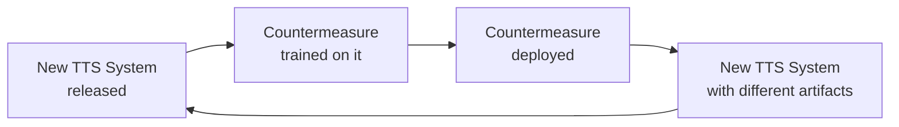

# 01 — Problem and Motivation

## Table of Contents

1. [What Is Audio Deepfake Detection?](#1-what-is-audio-deepfake-detection)
2. [Why It Matters](#2-why-it-matters)
3. [Why It Is Hard](#3-why-it-is-hard)
4. [The ASVspoof Challenge](#4-the-asvspoof-challenge)
5. [Logical Access vs Physical Access](#5-logical-access-vs-physical-access)
6. [The Detection Arms Race](#6-the-detection-arms-race)
7. [Why EER Is the Right Metric](#7-why-eer-is-the-right-metric)

---

## 1. What Is Audio Deepfake Detection?

An **audio deepfake** is a synthetic or manipulated speech signal produced by a machine to sound like a real human voice. The techniques used to generate these signals fall into two broad categories:

**Text-to-Speech (TTS)** systems take text as input and produce speech. Modern neural TTS systems (e.g., Tacotron 2, FastSpeech 2, VITS) can generate highly natural-sounding speech in any voice for which they have training data. A few seconds of a target speaker's voice is sometimes sufficient for voice cloning.

**Voice Conversion (VC)** systems take a real speech signal and transform its speaker identity while preserving the linguistic content. Rather than generating speech from scratch, they modify an existing utterance to sound like a different person.

**Audio deepfake detection** — also called **spoofing countermeasure** (CM) in the speaker verification literature — is the task of automatically determining whether a given audio clip was produced by a real human voice or by one of these generative systems. In formal terms, it is a binary classification problem:

```
f(audio) -> {bonafide, spoof}
```

where `bonafide` means genuine human speech and `spoof` means machine-generated or voice-converted speech.

This project trains and evaluates countermeasure systems in the context of the ASVspoof 2019 Logical Access scenario.

---

## 2. Why It Matters

### Speaker Verification Security

The immediate motivating application is **automatic speaker verification (ASV)** — biometric systems that authenticate users by their voice. These systems are deployed in bank call centers, phone-based customer authentication, smart speakers, and law enforcement forensics.

A spoofing attack against an ASV system works as follows:

1. An attacker obtains a short recording of the target speaker (a voicemail, a social media video, a YouTube clip).
2. The attacker feeds this recording into a voice cloning system.
3. The attacker uses the synthesized voice to authenticate as the victim.

Without a countermeasure, the ASV system accepts the fake audio as genuine because it was trained only to match acoustic characteristics, not to detect synthesis artifacts. A good countermeasure acts as a gatekeeper before the ASV system.

### Misinformation and Social Trust

Beyond authentication, audio deepfakes threaten public trust in recorded speech. Fabricated audio of politicians, executives, or public figures saying things they never said can be used for:

- Political manipulation and disinformation campaigns
- Financial fraud (impersonating executives in "vishing" attacks)
- Legal evidence tampering
- Personal harassment and non-consensual voice cloning

Audio has historically been treated as harder to fake than video (which is more visually scrutinized). As TTS quality reaches near-human levels, this assumption no longer holds.

### Scale of the Problem

The barrier to generating convincing fake speech has dropped dramatically. Open-source tools like Coqui TTS, Bark, and ElevenLabs allow non-technical users to clone voices with minimal data. This democratization means that audio deepfake detection is no longer an academic problem — it is an immediate practical need.

---

## 3. Why It Is Hard

Audio deepfake detection is hard for several reasons that compound each other.

### 3.1 TTS Quality Has Reached Near-Human Parity

Systems like VITS, YourTTS, and NaturalSpeech 2 produce speech that human listeners cannot reliably distinguish from real speech in controlled perceptual studies. When the generation artifact is below human perception threshold, detecting it requires the model to find statistical regularities that do not correspond to audible features — which is exactly the kind of pattern that can easily change across TTS generations.

### 3.2 The Feature Gap Between Known and Unknown Attacks

A countermeasure trained on TTS system A learns features specific to the artifacts of system A. When deployed against a different TTS system B, those features may be entirely absent. This is the **generalization problem** and it is the central challenge of this entire project.

The ASVspoof 2019 evaluation set was specifically designed to test this: the model is trained on attacks A01–A06 and tested on A07–A19, which use different underlying synthesis methods. The model achieves 0% EER on most of A07–A16 but 36.8% EER on A17 — showing that it learned features specific to vocoder-based synthesis and failed to generalize to neural codec synthesis.

### 3.3 Class Imbalance

In any real-world deployment, the fraction of spoofed attempts varies wildly. The ASVspoof 2019 training set itself is heavily imbalanced: 89.8% spoof, 10.2% bonafide. A naive classifier that always predicts "spoof" achieves 89.8% accuracy — a completely useless result. This is why accuracy is the wrong metric and why the training procedure must explicitly account for class imbalance.

### 3.4 Domain Mismatch Between Training and Deployment

Real deployments encounter audio that differs from training data in many ways:
- Different microphones and room acoustics
- Telephone channel effects (narrowband, codec compression)
- Background noise
- Languages and accents not seen during training
- Attack systems released after the model was trained

A countermeasure that achieved 0% EER in a lab setting may perform much worse in production.

### 3.5 Adversarial Attacks

An attacker who knows that a countermeasure is deployed can deliberately modify their synthetic speech to evade detection — for example, by adding noise, using adversarial perturbations, or using a TTS system specifically designed to avoid the artifacts the CM system detects. This adversarial dynamic means that static CM systems will eventually be defeated by adaptive attackers.

---

## 4. The ASVspoof Challenge

The **ASVspoof challenge series** is the primary research competition driving progress in countermeasure development. The challenges began in 2015 and have run in 2015, 2017, 2019, 2021, and 2024.

Each challenge releases:
- A labeled dataset of bonafide and spoofed utterances
- A protocol defining train, development, and evaluation splits
- Baseline systems for comparison
- An official evaluation metric (EER for 2019)

This project uses the **ASVspoof 2019** dataset. The 2019 challenge introduced two separate tracks:

- **LA (Logical Access)**: spoofed speech generated by TTS or VC systems presented directly to the ASV system. No physical channel between attacker and microphone.
- **PA (Physical Access)**: spoofed speech played through a loudspeaker and recorded by a microphone, introducing room acoustics and replay artifacts.

This project addresses only the LA track.

---

## 5. Logical Access vs Physical Access

### Logical Access (LA)

In the LA scenario, the attacker injects a synthetic waveform directly into the ASV system's digital input. There is no physical channel. The attack is:

```
[TTS/VC System] -> digital waveform -> [ASV System]
```

The artifacts that distinguish spoof from bonafide in this scenario are **synthesis artifacts** — spectral irregularities, phase discontinuities, unnatural formant transitions, and frequency-domain fingerprints left by the generation system.

This project's LCNN model learned to detect high-frequency aliasing artifacts characteristic of neural vocoders in the 2017–2019 era. This is confirmed by Grad-CAM analysis showing strong activation at 4–8 kHz for vocoder-based attacks.

### Physical Access (PA)

In the PA scenario, the attacker plays pre-recorded speech through a loudspeaker in front of a microphone that feeds the ASV system. The attack is:

```
[Recording] -> loudspeaker -> [room acoustics] -> microphone -> [ASV System]
```

The artifacts in this scenario are **replay artifacts** — reverberation, frequency response of the loudspeaker and microphone, room resonances. The detection challenge is completely different from LA.

This project does not address the PA scenario. A PA countermeasure would need to detect the acoustic signature of replay rather than synthesis artifacts.

---

## 6. The Detection Arms Race

The relationship between TTS/VC systems and countermeasures is a classic adversarial arms race. Understanding this dynamic is essential to interpreting this project's results.



### The Generalization Problem

The core challenge is that **countermeasures trained on the artifacts of system generation N do not generalize to generation N+1**. Each new generation of TTS technology produces qualitatively different artifacts:

| Generation | Representative systems | Primary artifacts |
|---|---|---|
| 2015–2017 | HMM-based TTS, concatenative synthesis | Spectral discontinuities, unnatural prosody |
| 2017–2019 | WaveNet, Tacotron, WaveGlow | High-frequency aliasing, phase irregularities |
| 2019–2021 | VITS, FastSpeech 2, Neural codec | Distributed spectral fingerprints, less obvious |
| 2021+ | VALL-E, SoundStorm, MaskGCT | Near-indistinguishable, context-dependent |

The ASVspoof 2019 evaluation set tests generalization from the 2017–2019 generation to a partially overlapping set of 2019-era systems. Our LCNN succeeds at this mostly (EER 7.07%) but fails spectacularly on A17 (neural codec attack, EER 36.8%).

### Why This Matters for Deployment

A countermeasure that achieves excellent EER on a fixed benchmark may have already learned the artifacts of systems that have been superseded. The real-world performance depends critically on whether the deployment-time attacks match the training-time attack distribution.

### Approaches to Better Generalization

1. **Larger, more diverse training sets**: Train on many attack families to avoid overfitting to specific artifacts.
2. **Foundation model features**: Use self-supervised speech representations (wav2vec 2.0, HuBERT) as input features — these capture more general acoustic properties.
3. **Graph-based architectures (AASIST)**: Model spectro-temporal relationships rather than pointwise frequency features.
4. **Adversarial training**: Explicitly train the model to be invariant to attack-specific features.
5. **Continual learning**: Retrain the model incrementally as new attack families are discovered.

---

## 7. Why EER Is the Right Metric

### The Problem with Accuracy

On the ASVspoof 2019 training set:
- 89.8% of samples are spoof
- 10.2% are bonafide

A classifier that predicts "spoof" for every input achieves **89.8% accuracy** while being completely useless — it accepts no bonafide speakers and rejects all spoof attempts. Accuracy is dominated by the majority class and tells us nothing about the detector's discriminative ability.

### False Acceptance Rate and False Rejection Rate

A binary classifier has two types of errors:

**False Acceptance Rate (FAR)** = the fraction of spoofed utterances that are incorrectly classified as bonafide. This is the security failure: a fake passes as real.

**False Rejection Rate (FRR)** = the fraction of bonafide utterances that are incorrectly classified as spoof. This is the usability failure: a real speaker is rejected.

FAR and FRR are controlled by a decision threshold `theta`. As `theta` decreases (more permissive), FAR increases and FRR decreases. As `theta` increases (more strict), FAR decreases and FRR increases.

### Equal Error Rate

The **Equal Error Rate (EER)** is the threshold at which FAR equals FRR. It provides a single-number summary of the detector's performance that is:

1. **Threshold-independent**: It describes the intrinsic separation capability of the model without requiring a decision threshold to be chosen in advance.
2. **Balanced**: By definition it treats false acceptance and false rejection as equally costly, removing the class-imbalance bias of accuracy.
3. **Interpretable**: EER = 0% means perfect separation. EER = 50% means the model is no better than random.
4. **Comparable across systems**: Different countermeasures trained on different systems can be compared on the same EER scale.

### How EER Is Computed in This Project

The implementation is in `src/evaluation/eer.py`:

```python
fpr, tpr, _ = roc_curve(labels, scores, pos_label=1)
fnr = 1 - tpr  # FRR
eer = brentq(lambda x: interp1d(fpr, fpr - fnr)(x), fpr[0], fpr[-1])
```

The steps are:
1. Compute the full ROC curve using sklearn's `roc_curve`, which sweeps across all possible thresholds and records `(FPR, TPR)` pairs. Here `FPR = FAR` and `TPR = 1 - FRR`.
2. Compute `FNR = 1 - TPR` (the false negative rate, which equals FRR in this context).
3. Find the threshold where `FAR = FRR` using Brent's method — a fast bracketing root-finding algorithm from scipy. This avoids the numerical instability of naive threshold sweeping.

The model outputs softmax probabilities for class 1 (spoof). A higher probability means "more likely spoof." The EER threshold is the softmax probability above which we declare the input to be spoof.

### Visualizing FAR/FRR

```
Error
Rate
 1.0 |
     |  FRR \       / FAR
     |       \     /
 0.5 |        \   /
     |         \ /
     |      EER *
     |         / \
 0.0 |--------/---\--------> Threshold
     0                  1
```

At the left (low threshold), everything is classified as spoof (high FAR = everything passes as spoof? No — low threshold means everything passes: bonafide accepted AND spoof accepted, so FAR is high and FRR is low). At the right (high threshold), everything is classified as bonafide (FRR is high, FAR is low). The crossing point is the EER.

### EER vs minDCF

The ASVspoof challenge also reports minDCF (minimum Detection Cost Function), which allows asymmetric costs for FAR and FRR. In a real deployment where a spoofed login is more costly than a rejected bonafide speaker, minDCF is more appropriate. However, EER is the primary metric used for model selection in this project because it is simpler and does not require specifying cost parameters.
