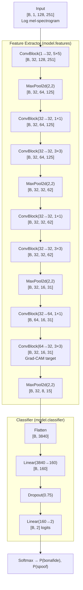
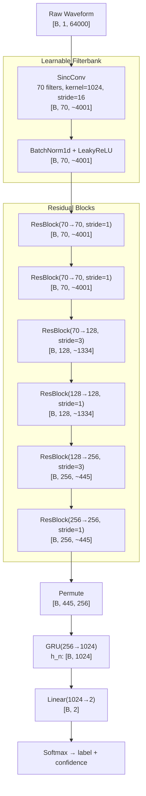

# 03 — Model Architecture

## Table of Contents

1. [Two-Model Philosophy](#1-two-model-philosophy)
2. [LCNN — Light CNN with Max-Feature-Map](#2-lcnn--light-cnn-with-max-feature-map)
3. [RawNet2 — End-to-End Raw Waveform Model](#3-rawnet2--end-to-end-raw-waveform-model)
4. [Architecture Comparison](#4-architecture-comparison)

---

## 1. Two-Model Philosophy

This project intentionally trains two architecturally distinct models. The choice reflects the two main schools of thought in countermeasure design.

**The spectrogram school (LCNN)** argues that the most reliable artifacts of synthesis are in the frequency domain — specifically in the spectral envelope, harmonic structure, and high-frequency content. These artifacts are made visible by computing a mel-spectrogram and passing it to a convolutional classifier. The model looks at "pictures of sound" and learns to spot unnatural patterns.

**The end-to-end school (RawNet2)** argues that hand-crafted feature extraction (FFT, mel filterbank) discards information — particularly phase information and fine temporal structure — that might be discriminative. By learning filters directly from raw waveforms, the model can in principle discover features that spectrogram-based models miss.

Training both allows direct comparison:
- Does hand-crafted preprocessing help (LCNN) or hurt (RawNet2)?
- Do the models fail on the same samples, or do they complement each other?
- Can ensembling them outperform either alone?

The answers from this project: LCNN wins by a large margin (7.07% vs 12.78% EER), the models fail on the same hard attacks (A17/A18), and ensembling hurts because errors are correlated.

---

## 2. LCNN — Light CNN with Max-Feature-Map

### 2.1 Origins and Motivation

The **Light CNN (LCNN)** architecture was originally developed for face recognition by Wu et al. (2015) in the paper "A Light CNN for Deep Face Representation with Noisy Labels." The key innovation was the **Max-Feature-Map (MFM)** activation function, which provides better noise suppression than ReLU.

The application to audio deepfake detection is natural: both face recognition from noisy data and audio spoofing detection require distinguishing subtle artifacts from a large amount of "normal" variation. The network needs to suppress irrelevant speaker-specific features while amplifying synthesis-related artifacts.

LCNN was adapted for ASVspoof by Lavrentyeva et al. (2017) and later refined for the 2019 challenge. It achieved state-of-the-art results in the 2017 challenge and remains competitive.

### 2.2 Max-Feature-Map (MFM) Activation

#### What MFM Does

Standard ReLU activation is:
```
ReLU(x) = max(x, 0)
```

MFM activation is a generalization. Instead of comparing each neuron's activation to zero (a fixed dead threshold), MFM compares two groups of neurons to each other:

```
Given input tensor x with C channels:
x1, x2 = split(x, C//2, dim=1)       # two halves: each has C/2 channels
MFM(x) = element-wise max(x1, x2)    # C/2 output channels
```

The result has **half the channels of the input**. This is why every `ConvBlock` in the code outputs `out_channels * 2` from the `Conv2d` — the MFM halves it back to `out_channels`.

#### Mathematical Formulation

Let the input to the ConvBlock be `h` with spatial position `(i, j)` and channel `k`. After convolution with filters `W_k`, we get feature maps `z` with `2C` channels. MFM computes:

```
output[k, i, j] = max(z[k, i, j], z[k + C, i, j])
for k in range(C)
```

Each output neuron is the maximum of two competing neurons in the previous layer.

#### Why MFM Over ReLU for Artifact Detection

MFM provides a **competitive inhibition** mechanism:

1. **Noise suppression**: Two filters that respond to similar features but one fires on noise will have the genuine feature win out in the max operation. ReLU would activate on both.

2. **Feature selection**: In a noisy training environment, MFM forces the network to maintain two alternative representations of each feature. The stronger representation wins. This is like having a "backup detector" for every feature.

3. **No dead neurons**: ReLU neurons that receive consistently negative inputs become permanently dead (gradient is zero). MFM neurons are never dead — even if one of the paired channels has negative activations, the other might win.

4. **Compact representation**: By halving the channel count, MFM provides built-in dimensionality reduction. The network is effectively forced to learn sparser, more discriminative representations.

In the context of deepfake detection, the hypothesis is that synthesis artifacts produce distinctive activation patterns in specific frequency bands. MFM allows these patterns to compete against speaker-specific features that also activate the same filters, with the artifact-related activations winning out.

#### Implementation in Code

```python
def mfm(x: torch.Tensor) -> torch.Tensor:
    x1, x2 = x.chunk(2, dim=1)   # split along channel dim
    return torch.max(x1, x2)

class ConvBlock(nn.Module):
    def __init__(self, in_channels, out_channels, kernel_size, padding=0):
        super().__init__()
        # 2x output channels: MFM will halve them back to out_channels
        self.conv = nn.Conv2d(in_channels, out_channels * 2, kernel_size, padding=padding)
        self.bn   = nn.BatchNorm2d(out_channels * 2)

    def forward(self, x):
        return mfm(self.bn(self.conv(x)))
        # shape: [B, out_channels*2, H, W] -> [B, out_channels, H, W]
```

### 2.3 The Conv2d → BatchNorm → MFM Pattern

Every layer in the LCNN feature extractor follows this exact sequence:

**Step 1: Conv2d**
The convolution applies learned 2D filters to the mel-spectrogram. Each filter responds to a specific time-frequency pattern. For example, a filter might learn to activate when it detects the characteristic "buzzing" alias pattern at 4–6 kHz that WaveGlow vocoders produce.

**Step 2: BatchNorm2d**
Batch normalization normalizes the activations within each batch before the MFM operation. This serves two purposes:
- Stabilizes training by preventing internal covariate shift
- Ensures that the two channels being compared in MFM have the same statistical scale. Without BN, one channel might dominate the max simply by having larger magnitude, not by being more informative.

**Step 3: MFM**
The competitive selection step. Halves the channel count and forces the network to keep only the more active of each channel pair.

### 2.4 1×1 Convolutions — What They Do

The LCNN uses 1×1 convolutions (ConvBlock with `kernel_size=1`) between 3×3 convolutions. The 1×1 convolution is a learned **linear combination of channels at each spatial location**. It does not look at neighboring spatial positions — only at the channel dimension.

Why use 1×1 convolutions?

1. **Channel mixing**: The preceding 3×3 convolution produced features that are localized in one frequency band. A 1×1 conv lets the network mix information across frequency bands without expanding the spatial receptive field.

2. **Bottleneck / non-linearity**: Even though it's "just" a linear combination, followed by BN + MFM, it adds another learned non-linear transformation stage. This effectively doubles the depth of the network cheaply.

3. **Channel dimensionality control**: In the LCNN, the 1×1 convolution at the position `ConvBlock(32→64, 1×1)` expands the channel count from 32 to 64, then `ConvBlock(64→32, 3×3)` compresses back to 32. This is a classic "expand then compress" pattern that gives the network temporary access to a higher-dimensional representation.

### 2.5 Complete Layer-by-Layer Breakdown

Input shape: `[B, 1, 128, 251]`
- B = batch size (32 during training)
- 1 = mono audio channel (the spectrogram is treated as a single-channel image)
- 128 = mel frequency bands (n_mels=128)
- 251 = time frames (computed from 64000 samples / hop_length=256 = 250.0, rounded: 251 frames)

```
Layer               Operation                              Output Shape
─────────────────────────────────────────────────────────────────────
Input               —                                      [B,  1, 128, 251]

features[0]         ConvBlock(1→32, 5×5, pad=2)            [B, 32, 128, 251]
                    └─ Conv2d(1, 64, 5, pad=2)             [B, 64, 128, 251]
                       BatchNorm2d(64)                     [B, 64, 128, 251]
                       MFM (chunk + max)                   [B, 32, 128, 251]

features[1]         MaxPool2d(2, 2)                        [B, 32,  64, 125]

features[2]         ConvBlock(32→32, 1×1)                  [B, 32,  64, 125]
                    └─ Conv2d(32, 64, 1)                   [B, 64,  64, 125]
                       BatchNorm2d(64)                     [B, 64,  64, 125]
                       MFM                                 [B, 32,  64, 125]

features[3]         ConvBlock(32→32, 3×3, pad=1)           [B, 32,  64, 125]
                    └─ Conv2d(32, 64, 3, pad=1)            [B, 64,  64, 125]
                       BatchNorm2d(64)                     [B, 64,  64, 125]
                       MFM                                 [B, 32,  64, 125]

features[4]         MaxPool2d(2, 2)                        [B, 32,  32,  62]

features[5]         ConvBlock(32→32, 1×1)                  [B, 32,  32,  62]
features[6]         ConvBlock(32→32, 3×3, pad=1)           [B, 32,  32,  62]

features[7]         MaxPool2d(2, 2)                        [B, 32,  16,  31]

features[8]         ConvBlock(32→64, 1×1)                  [B, 64,  16,  31]
                    └─ Conv2d(32, 128, 1)                  [B,128,  16,  31]
                       BatchNorm2d(128)
                       MFM                                 [B, 64,  16,  31]

features[9]         ConvBlock(64→32, 3×3, pad=1)           [B, 32,  16,  31]
                    └─ Conv2d(64, 64, 3, pad=1)            [B, 64,  16,  31]
                       BatchNorm2d(64)
                       MFM                                 [B, 32,  16,  31]
                    ↑ GRAD-CAM TARGET LAYER

features[10]        MaxPool2d(2, 2)                        [B, 32,   8,  15]

Flatten                                                    [B, 3840]
                    (32 × 8 × 15 = 3840)

Linear(3840 → 160)                                         [B, 160]
Dropout(0.75)        drops 75% of neurons during training  [B, 160]
Linear(160 → 2)                                            [B,   2]
```

### 2.6 Parameter Count Analysis

Each ConvBlock contains `Conv2d(in_ch, out_ch*2, kernel)` with parameters:
`(out_ch*2 × in_ch × kH × kW) + (out_ch*2)` (weights + biases)

Plus BatchNorm2d: `4 × out_ch*2` (gamma, beta, running_mean, running_var — last two are buffers not params)

| Layer | Parameters |
|---|---|
| ConvBlock(1→32, 5×5) | 64×1×5×5 + 64 = 1,664 |
| ConvBlock(32→32, 1×1) | 64×32×1×1 + 64 = 2,112 |
| ConvBlock(32→32, 3×3) | 64×32×3×3 + 64 = 18,496 |
| ConvBlock(32→32, 1×1) | 64×32×1×1 + 64 = 2,112 |
| ConvBlock(32→32, 3×3) | 64×32×3×3 + 64 = 18,496 |
| ConvBlock(32→64, 1×1) | 128×32×1×1 + 128 = 4,224 |
| ConvBlock(64→32, 3×3) | 64×64×3×3 + 64 = 36,928 |
| BatchNorm params (all) | ~1,024 |
| Linear(3840→160) | 3840×160 + 160 = 614,560 |
| Linear(160→2) | 160×2 + 2 = 322 |
| **Total** | **~699,938** |

The single `Linear(3840→160)` layer accounts for **614,560 / 699,938 = 87.8%** of all parameters. This is unusual — most of the model's capacity is in one linear layer. This is both a strength (the linear layer can learn complex decision boundaries in the compact feature space) and a weakness (the classifier is over-parameterized relative to the feature extractor).

### 2.7 Dropout 0.75 — Why So Aggressive

The first classifier layer is followed by `Dropout(0.75)`, meaning 75% of the 160 neurons are randomly zeroed during each training forward pass.

Why such aggressive dropout?

1. **The linear layer is very large (614K params) relative to the training set (25K examples).** Without regularization, it will memorize training speaker identities.

2. **The model needs to be robust to per-sample variation.** A single spectrogram of a bonafide speaker might have patches that look vaguely artificial due to reverberation or noise. Dropout forces the classifier to not rely on any single neuron's response.

3. **The feature extractor is frozen in meaning by Grad-CAM analysis.** The high-frequency artifact detection happens in the convolutional layers. The dropout in the classifier doesn't affect what the feature extractor learns — it prevents the classifier from memorizing based on speaker-specific features that leaked through.

Dropout 0.75 is unusual (0.5 is more common) but has been reported effective for audio classification tasks where the feature space has high speaker variability.

### 2.8 LCNN Architecture Diagram



---

## 3. RawNet2 — End-to-End Raw Waveform Model

### 3.1 End-to-End Philosophy

RawNet2 (Tak et al., 2021) eliminates handcrafted preprocessing entirely. It receives a raw waveform `[B, 1, 64000]` and performs all feature learning jointly during backpropagation. This is philosophically different from LCNN:

| Aspect | LCNN | RawNet2 |
|---|---|---|
| Input | Log mel-spectrogram | Raw waveform |
| Feature extraction | Fixed (FFT + mel filterbank) | Learned (SincConv) |
| Phase information | Discarded | Partially preserved |
| Temporal resolution | 16ms per frame | 1/16000 sec (full) |
| Frequency resolution | 128 mel bands | Determined by learned filters |

The potential advantage: the model can learn to detect artifacts that exist in the phase or in very fine temporal structure — features that a mel-spectrogram discards. The practical disadvantage: it takes much longer to train because the model must learn both feature extraction and classification from scratch.

### 3.2 SincConv — Learnable Bandpass Filters

#### The Idea

`SincConv` implements a bank of **bandpass filters** where the filter shapes are constrained to be sinc functions. Unlike unconstrained CNN filters (which can learn arbitrary, potentially non-physical patterns), SincConv filters are parameterized by just two numbers per filter:

- `f1`: lower cutoff frequency (Hz)
- `f2`: bandwidth (Hz) — actual upper cutoff is `f1 + f2`

A bandpass filter is the difference of two lowpass filters:

```
h_bandpass(t) = h_lowpass(f2, t) - h_lowpass(f1, t)
```

where the ideal lowpass filter at cutoff frequency `f_c` has the sinc impulse response:

```
h_lowpass(f_c, t) = 2 * f_c * sinc(2 * f_c * t)
where sinc(x) = sin(pi*x) / (pi*x)
```

So the bandpass filter at position `t` in the kernel is:

```
h[t] = 2*f2*sinc(2*f2*t) - 2*f1*sinc(2*f1*t)
```

#### Why Constrained Filters Beat Unconstrained for This Task

1. **Fewer parameters**: Each filter is defined by 2 numbers instead of 1024 (kernel size). This dramatically reduces the risk of overfitting.

2. **Physically interpretable**: Each filter corresponds to a specific frequency band. After training, you can inspect `f1` and `f2` to see which frequency ranges the model finds discriminative.

3. **Symmetry**: The filter `h[t] = h[-t]` by construction (symmetric bandpass). This gives zero phase response — the filter doesn't shift the signal in time, only selects frequencies. This is important for artifact detection where temporal alignment matters.

4. **Mel initialization**: The filters are initialized with cutoff frequencies spaced on the mel scale — the same frequency spacing used by the mel filterbank in LCNN. This gives RawNet2 a warm start that covers the full speech frequency range, not a random initialization that might cluster all filters in one frequency region.

#### Hamming Window

The ideal sinc function has infinite extent in time. In practice, we must truncate it to a finite kernel of length 1024. Truncation causes **spectral leakage** — energy from the pass band spills into the stop band. To mitigate this, we apply a **Hamming window**:

```
window[n] = 0.54 - 0.46 * cos(2*pi*n / kernel_size)
```

The Hamming window tapers the filter smoothly to zero at both ends, reducing the abrupt truncation effect. The complete windowed bandpass filter is:

```
h_windowed[t] = h_bandpass[t] * window[t]
```

#### Mel-Scale Initialization

The initial cutoff frequencies are evenly spaced on the mel scale between 30 Hz and 7900 Hz:

```python
mel_low  = hz_to_mel(30.0)    # ~63 mel
mel_high = hz_to_mel(7900.0)  # ~2840 mel
mel_points = linspace(mel_low, mel_high, 72)   # 70 filters + 2 boundary points
hz_points  = mel_to_hz(mel_points)             # back to Hz
f1_init    = hz_points[:-2]                    # lower cutoffs
f2_init    = hz_points[1:-1] - hz_points[:-2]  # bandwidths
```

At the mel scale, equal intervals correspond to perceptually equal pitch intervals. Low frequencies are spaced more finely than high frequencies — which matches how speech information is distributed. The mel initialization gives RawNet2 a reasonable prior while allowing gradient descent to refine the filter frequencies during training.

#### Stride=16 Downsampling

SincConv applies with `stride=16`, reducing the time dimension from 64,000 to approximately 64,000/16 = 4,000 frames. This is the first downsampling step. Subsequent downsampling happens via stride in the ResBlocks.

#### SincConv Implementation

```python
def forward(self, x):
    f1 = torch.abs(self.f1) / self.sample_rate          # normalize to [0, 0.5]
    f2 = torch.abs(self.f1 + torch.abs(self.f2)) / self.sample_rate
    f2 = torch.max(f2, f1 + 1e-6)   # ensure f2 > f1
    f2 = torch.clamp(f2, max=0.5)   # ensure f2 < Nyquist

    t = self.t.unsqueeze(0)              # [1, 512]
    lp_f2 = 2 * f2 * torch.sinc(2 * f2 * t)  # [70, 512]
    lp_f1 = 2 * f1 * torch.sinc(2 * f1 * t)  # [70, 512]
    band   = (lp_f2 - lp_f1) * self.window   # apply Hamming window

    # Symmetric filter: flip and concatenate to get full 1024-point kernel
    filters = torch.cat([band.flip(1), band], dim=1).unsqueeze(1)  # [70, 1, 1024]

    return F.conv1d(x, filters, stride=16, padding=512)
```

The constraint `f2 = torch.abs(self.f1 + torch.abs(self.f2))` ensures the upper cutoff is always above the lower cutoff. The absolute values ensure both cutoffs are positive (physical frequencies).

### 3.3 ResBlock — Skip Connections and Vanishing Gradients

#### The Vanishing Gradient Problem

In deep networks, gradients can become exponentially small as they propagate backward through many layers. This is the **vanishing gradient problem** — early layers receive tiny gradients and learn very slowly or not at all. With 6 ResBlocks on top of SincConv on top of raw waveforms, vanishing gradients would prevent learning.

#### The Skip Connection Solution

Each `ResBlock` computes:

```
output = F(x) + shortcut(x)
output = LeakyReLU(output)
```

where `F(x) = BN(Conv1d(BN(Conv1d(x))))` is the learned transformation and `shortcut(x)` is either the identity (if channels and time match) or a 1×1 convolution (if they don't).

The key insight: gradients flow through the addition. The gradient of the loss with respect to the block's input is:

```
dL/dx = dL/d_output * (dF/dx + d_shortcut/dx)
```

The `d_shortcut/dx` term is either 1 (identity) or the gradient of a 1×1 conv (close to 1 at initialization). This means gradients can flow directly through the skip connection without passing through any activation function, preventing the exponential decay.

#### LeakyReLU vs ReLU

The ResBlocks use `LeakyReLU(0.01)` instead of standard ReLU. The difference: LeakyReLU allows a small gradient (0.01) for negative activations:

```
LeakyReLU(x, alpha=0.01) = x if x >= 0
                           = 0.01 * x if x < 0
```

This prevents dead neurons (neurons that never activate). In a deep architecture processing raw waveforms, where many activations can be negative for extended periods, LeakyReLU maintains a gradient signal for recovery.

#### Downsampling Strategy

The 6 ResBlocks apply downsampling via stride at specific positions:

```
ResBlock(70→70,   stride=1)    [B,  70, ~4000]   identity shortcut
ResBlock(70→70,   stride=1)    [B,  70, ~4000]   identity shortcut
ResBlock(70→128,  stride=3)    [B, 128, ~1333]   1x1 shortcut, 3x downsampling
ResBlock(128→128, stride=1)    [B, 128, ~1333]   identity shortcut
ResBlock(128→256, stride=3)    [B, 256,  ~444]   1x1 shortcut, 3x downsampling
ResBlock(256→256, stride=1)    [B, 256,  ~444]   identity shortcut
```

Total temporal downsampling: 16 (SincConv stride) × 3 × 3 = **144x** reduction in time dimension.
Final time dimension: 64000 / 144 ≈ 444 frames.

Each ResBlock shortcut adjusts dimensions when `stride != 1` or `in_channels != out_channels`:

```python
self.shortcut = nn.Sequential(
    nn.Conv1d(in_channels, out_channels, 1, stride=stride, bias=False),
    nn.BatchNorm1d(out_channels),
) if stride != 1 or in_channels != out_channels else nn.Identity()
```

### 3.4 GRU — Sequential Context

After the ResBlocks, the feature map is `[B, 256, ~444]`. Before feeding to the GRU, it is permuted to `[B, 444, 256]` — the GRU expects `[batch, time, features]` with `batch_first=True`.

#### Why GRU?

The ResBlock output is a sequence of 444 time steps, each with 256 features. The features at adjacent time steps are correlated (speech has temporal context). A simple pooling operation (like mean or max) would lose this temporal structure.

A **Gated Recurrent Unit (GRU)** processes the sequence step by step, maintaining a hidden state `h_t` that summarizes all past information:

```
r_t = sigmoid(W_r * [h_{t-1}, x_t] + b_r)    # reset gate
z_t = sigmoid(W_z * [h_{t-1}, x_t] + b_z)    # update gate
n_t = tanh(W_n * [r_t * h_{t-1}, x_t] + b_n) # candidate hidden
h_t = (1 - z_t) * h_{t-1} + z_t * n_t         # new hidden
```

The **reset gate** `r_t` controls how much of the past hidden state to use when computing the new candidate. When `r_t ≈ 0`, the previous state is forgotten.

The **update gate** `z_t` controls how much of the new candidate vs. the old hidden state to keep. When `z_t ≈ 1`, the hidden state is mostly replaced by the new candidate.

At the end of the sequence, `h_N` (the final hidden state, shape `[1, B, 1024]`) summarizes the entire temporal context of the utterance. This is squeezed to `[B, 1024]` and passed to the final linear layer.

#### Why Sequential Context Matters

Synthesis artifacts are not always present in every frame. A vocoder might produce artifacts at specific moments (e.g., at voicing transitions, at the end of phonemes). A per-frame classifier would classify each frame independently and combine scores. A GRU can in principle model "if the previous frame had artifact X, and this frame has Y, then the overall pattern is Z" — learning temporal artifact patterns.

In practice, for this dataset and architecture, the GRU's benefit over global average pooling is moderate. The GRU adds significant computational cost and training time while providing modest accuracy improvement.

### 3.5 Complete Layer-by-Layer Breakdown

Input shape: `[B, 1, 64000]`
- B = batch size (32)
- 1 = mono channel
- 64000 = 4 seconds at 16kHz

```
Layer               Operation                                Output Shape
───────────────────────────────────────────────────────────────────────
Input               —                                        [B, 1, 64000]

SincConv            70 bandpass filters, kernel=1024,        [B, 70, ~4000]
                    stride=16, padding=512
                    (exact: (64000 + 2*512 - 1024)/16 + 1 = 4001)

bn0                 BatchNorm1d(70)                          [B, 70, 4001]
                    LeakyReLU(0.01)                          [B, 70, 4001]

res_blocks[0]       ResBlock(70→70, stride=1)                [B, 70, 4001]
res_blocks[1]       ResBlock(70→70, stride=1)                [B, 70, 4001]
res_blocks[2]       ResBlock(70→128, stride=3)               [B, 128, 1334]
res_blocks[3]       ResBlock(128→128, stride=1)              [B, 128, 1334]
res_blocks[4]       ResBlock(128→256, stride=3)              [B, 256, 445]
res_blocks[5]       ResBlock(256→256, stride=1)              [B, 256, 445]

permute             [B, 256, 445] → [B, 445, 256]           [B, 445, 256]

gru                 GRU(input=256, hidden=1024,              h_n: [1, B, 1024]
                    batch_first=True)

squeeze             h_n[0]                                   [B, 1024]

fc                  Linear(1024→2)                           [B, 2]
```

### 3.6 Parameter Count

| Component | Parameters |
|---|---|
| SincConv f1, f2 params | 70 × 2 = 140 |
| BatchNorm1d(70) | 70 × 2 = 140 |
| ResBlock(70→70) × 2 | ~2 × (2 × 70×70×3 + BN) ≈ 60,480 |
| ResBlock(70→128, stride=3) | 70×128×3 + 128×128×3 + shortcut + BN ≈ 123,264 |
| ResBlock(128→128) | ~200,192 |
| ResBlock(128→256, stride=3) | ~426,752 |
| ResBlock(256→256) | ~788,480 |
| GRU(256→1024) | 3 × (256×1024 + 1024×1024 + 1024) × 2 ≈ 3,148,800 |
| Linear(1024→2) | 1024×2 + 2 = 2,050 |
| **Total** | **~4,908,026** |

The GRU accounts for roughly 64% of all parameters. Its `hidden_size=1024` is very large relative to its input size of 256 — this gives it enormous capacity to model temporal patterns but also makes it the bottleneck for both memory and training time.

### 3.7 RawNet2 Architecture Diagram



---

## 4. Architecture Comparison

| Property | LCNN | RawNet2 |
|---|---|---|
| Input | Log mel-spectrogram [B, 1, 128, 251] | Raw waveform [B, 1, 64000] |
| Feature extraction | Fixed (FFT + mel filterbank) | Learned (SincConv) |
| Core operation | 2D convolution | 1D convolution + GRU |
| Activation | MFM (competitive) | LeakyReLU |
| Parameters | 699,938 | 4,908,026 |
| Phase information | Discarded | Partially preserved |
| Temporal modeling | Global (MaxPool aggregation) | Sequential (GRU) |
| Training time | ~28 epochs to convergence | ~100+ epochs |
| Dev EER | 0.0000% | 2.4700% |
| Eval EER | 7.0724% | 12.7814% |
| A17 EER | 36.8457% | 40.3807% |
| Grad-CAM compatible | Yes (2D ConvBlock output) | No (1D + GRU) |
| Deployment size | ~2.7 MB | ~18.7 MB |

### Why LCNN Outperforms RawNet2 in This Experiment

1. **Fixed mel features are a good prior for speech**: The mel filterbank was designed based on decades of psychoacoustic research and speech processing. Giving the model features that are already semantically meaningful (frequency bands aligned with formant structure) allows it to find artifact patterns faster.

2. **LCNN is simpler and trains faster**: With 7× fewer parameters and no recurrent computation, LCNN converges in 28 epochs. RawNet2 needed 100+ epochs. The Adam optimizer and cosine schedule work well for both, but the optimization landscape for LCNN is much smoother.

3. **The vocoder artifacts are spectral, not temporal**: For the majority of attacks (A07–A16), the distinguishing artifacts are frequency-domain patterns. LCNN sees these directly. RawNet2 has to learn to extract them from raw waveforms, which takes more data and more iterations.

4. **RawNet2 may be undertrained**: The dev EER of 2.47% suggests RawNet2 has good capacity for this task. With more training epochs or better scheduling, it might approach LCNN's performance.
