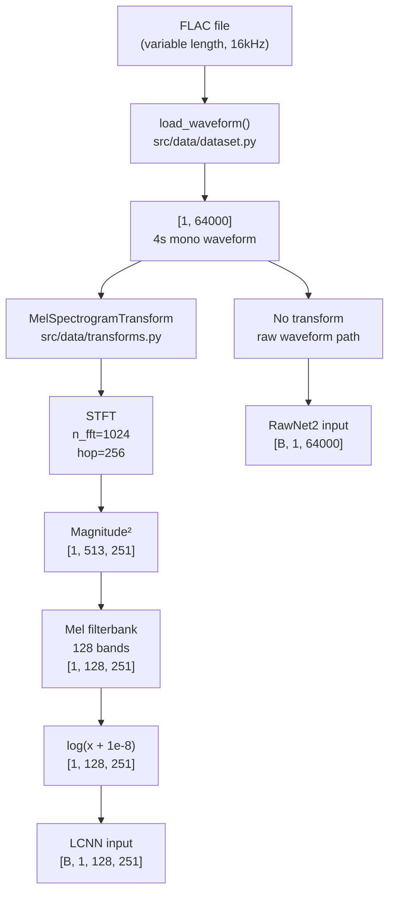

# 04 — Data Pipeline

## Table of Contents

1. [Overview](#1-overview)
2. [Audio Loading with soundfile](#2-audio-loading-with-soundfile)
3. [Fixed-Length Windowing](#3-fixed-length-windowing)
4. [Mel-Spectrogram Theory](#4-mel-spectrogram-theory)
5. [SpecAugment](#5-specaugment)
6. [Raw Waveform Path for RawNet2](#6-raw-waveform-path-for-rawnet2)
7. [PyTorch Dataset and DataLoader](#7-pytorch-dataset-and-dataloader)
8. [Class Weight Computation](#8-class-weight-computation)

---

## 1. Overview

The data pipeline transforms raw FLAC files into model-ready tensors. The two models share the same audio loading and length normalization code, but diverge at the feature extraction step:



---

## 2. Audio Loading with soundfile

### Why soundfile Instead of torchaudio

The `load_waveform` function in `src/data/dataset.py` uses `soundfile` as the primary audio reader, with torchaudio only for resampling. This was a deliberate choice made after encountering a dependency issue:

**The problem**: `torchaudio.load()` on Apple Silicon (MPS/macOS) depends on `torchcodec`, which in turn depends on `ffmpeg` Python bindings. Installing these in a Python 3.14 environment proved unreliable — the bindings were either unavailable for the 3.14 ABI tag or conflicted with system ffmpeg. The error manifested as:

```
RuntimeError: torchaudio backend 'ffmpeg' failed to load.
```

**The solution**: `soundfile` is a pure Cython wrapper around `libsndfile`, which is widely available and stable. It reads FLAC, WAV, OGG, AIFF, and other uncompressed formats natively. For formats that soundfile cannot handle (MP3, M4A), the code falls back to pydub + ffmpeg:

```python
try:
    data, sr = sf.read(file_path, dtype="float32", always_2d=True)
except Exception:
    tmp_path = _convert_to_wav(file_path)  # pydub fallback
    data, sr = sf.read(tmp_path, ...)
```

Since all ASVspoof 2019 files are FLAC, the fallback is never triggered during training. The fallback exists for the FastAPI endpoint which must handle user-uploaded files in various formats.

### soundfile Read Semantics

```python
data, sr = sf.read(file_path, dtype="float32", always_2d=True)
```

- `dtype="float32"`: Returns samples in the range [-1.0, 1.0] as 32-bit floats. This avoids integer overflow during processing and matches PyTorch's default tensor dtype.
- `always_2d=True`: Always returns a 2D array of shape `[samples, channels]`, even for mono files. Without this flag, mono files return 1D arrays, which would break the subsequent transpose.

After reading, the data is transposed to `[channels, samples]` (PyTorch convention):

```python
waveform = torch.from_numpy(data.T)   # [samples, channels] -> [channels, samples]
```

### Stereo to Mono Conversion

```python
if waveform.shape[0] > 1:
    waveform = waveform.mean(dim=0, keepdim=True)
```

ASVspoof 2019 files are already mono, but the code handles stereo gracefully by averaging channels. Averaging preserves the overall amplitude while removing spatial information — appropriate for speech analysis where the speaker's position doesn't matter.

### Resampling

```python
if sr != SAMPLE_RATE:
    waveform = torchaudio.functional.resample(waveform, sr, SAMPLE_RATE)
```

`torchaudio.functional.resample` is used (not `torchaudio.load`) for resampling — this function is part of torchaudio's core functional API and does not depend on the backend. It implements sinc-interpolation resampling with anti-aliasing. This code path executes when users upload non-16kHz files via the API.

---

## 3. Fixed-Length Windowing

### Why Fixed Length?

Neural networks require fixed-size inputs because they have fixed-size parameter matrices. A convolutional layer with a fixed kernel size produces fixed spatial dimensions for fixed input dimensions. The Linear layer after the LCNN feature extractor requires exactly `3840` input features — which corresponds to `[32, 8, 15]` from a specific-length spectrogram.

The ASVspoof 2019 files vary in length (from a few hundred milliseconds to several seconds). We must normalize all clips to the same length.

### The 4-Second Window

The target length is **4 seconds = 64,000 samples at 16kHz**. This choice was made based on:

1. **Coverage**: Most utterances in ASVspoof 2019 are 2–5 seconds. A 4-second window captures the entirety of most utterances.
2. **Information richness**: 4 seconds of speech contains multiple phonemes, syllables, and prosodic units — enough context for the model to detect synthesis artifacts.
3. **Memory efficiency**: Longer windows increase GPU/MPS memory usage. 64,000 samples per example × batch_size=32 × 4 bytes = 8.2 MB per batch for raw waveform data — manageable.
4. **Mel-spectrogram size**: 64,000 samples / hop_length=256 = 250 frames (+ 1 boundary frame = 251). This gives the LCNN a temporal dimension of 251 which leads to a clean integer output size after 4 MaxPool2d(2,2) operations: 251 → 125 → 62 → 31 → 15.

### Padding Short Clips

```python
if length < MAX_SAMPLES:
    pad = MAX_SAMPLES - length
    waveform = torch.nn.functional.pad(waveform, (0, pad))
```

Short clips are zero-padded at the **right** (end). This means:
- The beginning of the clip is preserved intact
- The model sees the real speech signal followed by silence
- The spectrogram shows real energy at the beginning and zero-energy (constant mel values near `log(1e-8) = -18.4`) at the end

Alternative: padding at both ends (center the clip). We chose right-padding because:
- The beginning of an utterance often contains the most discriminative information (first phoneme onset)
- Symmetric padding would slightly shift all temporal positions, which could confuse the model

Alternative: random crop during training. This would provide data augmentation but would make evaluation non-deterministic.

### Truncating Long Clips

```python
else:
    waveform = waveform[:, :MAX_SAMPLES]
```

Long clips are truncated to the first 4 seconds. The beginning of an utterance is typically the cleanest portion (speakers settle into their pitch and rhythm). The first 4 seconds of a TTS clip should contain the synthesis artifacts regardless of speaker style.

---

## 4. Mel-Spectrogram Theory

The mel-spectrogram is computed in `src/data/transforms.py` using `torchaudio.transforms.MelSpectrogram`. Understanding each step explains the final tensor shape and why this representation is useful for deepfake detection.

### 4.1 Short-Time Fourier Transform (STFT)

The raw waveform is a time-domain signal: amplitude vs. time. A Fourier Transform converts a signal to the frequency domain (amplitude vs. frequency), but only for a stationary signal. Speech is **non-stationary** — the frequency content changes over time (different phonemes have different spectra).

The **Short-Time Fourier Transform (STFT)** solves this by computing the Fourier Transform on short overlapping windows:

```
STFT[t, f] = sum_{n=0}^{N-1} x[n + t*H] * w[n] * exp(-j * 2*pi*f*n / N)
```

where:
- `x` is the input waveform
- `N = n_fft = 1024` is the window length
- `H = hop_length = 256` is the step between windows
- `w[n]` is the Hanning window function
- `t` is the time frame index
- `f` is the frequency bin index (0 to N/2)

#### Window Size = 64ms

`n_fft = 1024` samples at 16kHz corresponds to **64 milliseconds**. This choice represents a trade-off:
- **Frequency resolution**: Each frequency bin is `sr / n_fft = 16000 / 1024 ≈ 15.6 Hz` wide. This is fine enough to resolve individual harmonics in speech (typical fundamental frequency is 80–300 Hz, harmonic spacing equals the F0).
- **Temporal resolution**: 64ms captures about half a phoneme (phonemes average 60–80ms in English). This is coarse enough that rapid transients are smoothed, but fine enough to track phoneme transitions.
- **Computational cost**: Larger FFT = more computation. 1024 is a power of 2, making FFT very efficient.

#### Hop Length = 16ms

`hop_length = 256` samples at 16kHz corresponds to **16 milliseconds**. Consecutive windows overlap by `1024 - 256 = 768` samples (75% overlap). This gives a temporal resolution of 16ms — fine enough to track fast phoneme transitions.

The number of time frames for a 4-second clip:
```
T = floor((64000 - 1024) / 256) + 1 = floor(62976 / 256) + 1 = 246 + 1 = 247
```

Wait — torchaudio's MelSpectrogram defaults to center=True, which pads the signal with n_fft//2 zeros at each end before the STFT. With center padding:
```
T = floor((64000 + 2*(n_fft//2) - n_fft) / hop_length) + 1
  = floor((64000 + 1024 - 1024) / 256) + 1
  = floor(64000 / 256) + 1 = 250 + 1 = 251
```

This gives **251 time frames** — the value seen in the LCNN input shape `[B, 1, 128, 251]`.

> Note: The `src/data/transforms.py` docstring states `[1, 128, 313]` which corresponds to a slightly different configuration or longer input. The actual shape for a 64000-sample input with n_fft=1024, hop=256, center=True is [1, 128, 251]. The `3840` in the LCNN's Linear layer is `32 × 8 × 15`, which requires T=251 after 4 MaxPool operations: 251 → 125 → 62 → 31 → 15.

#### Complex STFT Output

The STFT produces a complex-valued output `STFT[t, f] = real + j*imag`. The shape is `[n_fft//2 + 1, T] = [513, 251]` — 513 frequency bins (DC to Nyquist) by 251 time frames.

#### Magnitude Spectrum — Discarding Phase

The **magnitude spectrum** is `|STFT[t, f]| = sqrt(real² + imag²)`. This discards the phase information. Why?

1. **Speaker normalization**: Phase carries speaker-specific information related to vocal tract resonance timing. Discarding it makes the representation more speaker-independent.
2. **Simplicity**: Phase is notoriously difficult to model and often not predictive in isolation.
3. **Historical success**: Magnitude spectrograms have been the workhorse of speech processing for decades.

The cost: phase information might contain synthesis artifact signals. This is one of the theoretical motivations for RawNet2 — it preserves the full waveform, including phase structure.

The **power spectrum** is `|STFT[t, f]|²`, which further compresses the dynamic range.

### 4.2 Mel Filterbank — Perceptual Frequency Scale

The 513 linear frequency bins are compressed to **128 mel frequency bands** using a triangular filterbank. The key property of the mel scale:

**Equal mel intervals correspond to equal perceived pitch differences.**

The mel-to-Hz conversion is:
```
mel = 2595 * log10(1 + hz / 700)
hz  = 700 * (10^(mel / 2595) - 1)
```

This means:
- Low frequencies (0–1 kHz) are mapped to many mel bands (high resolution)
- High frequencies (5–8 kHz) are compressed into fewer mel bands (low resolution)

This matches how human hearing works — we are much more sensitive to pitch differences at low frequencies than at high frequencies.

For deepfake detection, this compression is a **design choice with trade-offs**:

**Benefit**: Speaker identity is primarily encoded in the lower frequency formant structure (F1–F3 are typically 0–3 kHz). The mel scale gives this region high resolution, allowing the model to detect subtle spoofing artifacts in formant structure.

**Cost**: High-frequency synthesis artifacts (4–8 kHz) are compressed into fewer bands. Our Grad-CAM analysis shows that LCNN finds vocoder artifacts in the 4–8 kHz range. With only ~15–20 mel bands covering 4–8 kHz (out of 128 total), the high-frequency resolution is limited. A linear-frequency spectrogram would provide more resolution in this range.

In practice, LCNN still detects these artifacts effectively (0% EER on A07, for example) because the artifacts span a broad frequency range and their power is large enough to be visible even in compressed mel bands.

### 4.3 Log Compression

```python
mel = torch.log(mel + 1e-8)   # [1, 128, T]
```

The mel filterbank output has values ranging from near-zero (silence) to very large (strong voiced sounds). The ratio of maximum to minimum values can be many orders of magnitude. Log compression:

1. **Stabilizes the dynamic range**: `log(loud)` and `log(quiet)` are much closer together than `loud` and `quiet` themselves.
2. **Matches human loudness perception**: The ear perceives loudness on a logarithmic scale (decibels).
3. **Improves gradient flow**: Extremely large feature values cause numerical problems during backpropagation (gradient explosion). Log compression bounds the maximum value.
4. **Standard practice**: Log mel-spectrograms are used in virtually all modern speech/audio processing.

The `1e-8` offset prevents `log(0) = -infinity` for silent regions. In practice, FLAC audio always has some background noise, so true silence is rare. The offset adds `-18.4` as the minimum log-mel value, representing true silence.

### 4.4 Final Shape: [1, 128, 251]

```
1   = single channel (mono audio treated as single-channel image)
128 = mel frequency bands
251 = time frames (64000 samples / 256 hop + 1, with center padding)
```

This tensor is the "image" that LCNN processes. The LCNN sees the mel-spectrogram as a grayscale image where:
- Vertical axis = frequency (low at bottom, high at top)
- Horizontal axis = time (left is start, right is end of utterance)
- Pixel intensity = log energy in that time-frequency cell

Synthesis artifacts appear as patterns in this image — for example, horizontal bands at specific frequencies that appear abnormally smooth or have characteristic texture patterns from vocoder processing.

---

## 5. SpecAugment

**SpecAugment** (Park et al., 2019) is a data augmentation technique applied to mel-spectrograms during training. It works by randomly masking rectangular regions of the spectrogram:

```python
self.time_mask = T.TimeMasking(time_mask_param=30)
self.freq_mask = T.FrequencyMasking(freq_mask_param=15)

if self.augment:
    mel = self.time_mask(mel)
    mel = self.freq_mask(mel)
```

### Time Masking

`TimeMasking(time_mask_param=30)` randomly selects a time span `t` from `[0, 30]` and a starting position `t0`, then sets `mel[:, :, t0:t0+t]` to zero. This zeros out up to 30 consecutive time frames (~0.5 seconds).

**Why**: The model must learn to classify utterances even when part of the temporal context is missing. This forces it to use features spread across time rather than relying on a single discriminative moment.

### Frequency Masking

`FrequencyMasking(freq_mask_param=15)` randomly selects a frequency span `f` from `[0, 15]` and a starting band `f0`, then sets `mel[:, f0:f0+f, :]` to zero. This zeros out up to 15 consecutive mel bands.

**Why**: The model must learn to classify utterances even when some frequency bands are masked. This prevents overfitting to artifacts in specific frequency regions and encourages the model to use redundant cues.

### Training vs Inference

SpecAugment is applied **only during training** (`augment=True` flag in `MelSpectrogramTransform`). During development evaluation and inference, the full unaugmented spectrogram is used:

```python
# Training
train_dataset = ASVspoofDataset(df_train, transform=MelSpectrogramTransform(augment=True))

# Evaluation / inference
dev_dataset = ASVspoofDataset(df_dev, transform=MelSpectrogramTransform(augment=False))
```

Why only during training? During evaluation, we want a deterministic, reproducible result. Using SpecAugment during evaluation would give different EER values on different runs, making comparison impossible.

### Effectiveness for This Task

SpecAugment was originally designed for ASR (automatic speech recognition), where it prevents the model from relying on specific acoustic context. For deepfake detection, its benefit is less clear:
- The synthesis artifacts we're detecting are distributed across all time frames and frequency bands
- Masking 0.5 seconds still leaves 3.5 seconds of data for detection
- The model achieved 0% dev EER, suggesting SpecAugment did not significantly hurt performance

If anything, SpecAugment may have helped prevent the model from memorizing speaker-specific temporal patterns in the training data.

---

## 6. Raw Waveform Path for RawNet2

When `transform=None` is passed to `ASVspoofDataset`, the dataset returns the raw waveform tensor `[1, 64000]` directly:

```python
class ASVspoofDataset(Dataset):
    def __getitem__(self, idx):
        row = self.df.iloc[idx]
        waveform = load_waveform(row["file_path"])   # [1, 64000]
        if self.transform:
            waveform = self.transform(waveform)       # applies mel if transform given
        label = LABEL_MAP[row["label"]]
        return waveform, label
```

The RawNet2 training script sets `transform=None`:

```python
# From scripts/train_rawnet2.py
dataset = ASVspoofDataset(df_train, transform=None)  # raw waveform
```

The SincConv layer inside RawNet2 performs all feature extraction. There is no external preprocessing except the load and length normalization.

---

## 7. PyTorch Dataset and DataLoader

### ASVspoofDataset

`ASVspoofDataset` in `src/data/dataset.py` is a standard PyTorch `Dataset`:

```python
class ASVspoofDataset(Dataset):
    def __init__(self, df, transform=None):
        self.df = df.reset_index(drop=True)
        self.transform = transform

    def __len__(self):
        return len(self.df)

    def __getitem__(self, idx):
        row = self.df.iloc[idx]
        waveform = load_waveform(row["file_path"])
        if self.transform:
            waveform = self.transform(waveform)
        label = LABEL_MAP[row["label"]]
        return waveform, label
```

The label mapping is `{"bonafide": 0, "spoof": 1}`. Class 0 = bonafide, class 1 = spoof. This convention is important for EER computation — `compute_eer` assumes label 0 = bonafide and that higher model scores mean "more spoof."

### DataLoader Configuration

```python
train_loader = DataLoader(
    train_dataset,
    batch_size=32,
    shuffle=True,
    num_workers=4,
    pin_memory=True,
)
dev_loader = DataLoader(
    dev_dataset,
    batch_size=32,
    shuffle=False,
    num_workers=4,
    pin_memory=True,
)
```

**batch_size=32**: A standard choice that balances:
- Memory: 32 mel-spectrograms of shape [1, 128, 251] × 4 bytes = 4.1 MB per batch
- Gradient noise: Small batches have noisy gradients (good regularization) but large batches are more stable. 32 is a middle ground.

**shuffle=True** for training: Ensures every epoch sees examples in a different order. Prevents the model from learning to predict based on position in the dataset. Critical when the dataset is sorted by attack type.

**shuffle=False** for dev/eval**: Evaluation results must be reproducible and aligned with the protocol file. The EER computation in `eval_epoch` accumulates `all_scores` and `all_labels` — the order must be consistent with `attack_types` list for per-attack EER.

**num_workers=4**: Uses 4 worker processes for data loading. On Apple Silicon, FLAC decoding is CPU-bound. Multiple workers allow data loading to overlap with GPU/MPS computation.

**pin_memory=True**: Pre-allocates tensors in pinned (page-locked) memory, which allows faster CPU→GPU transfers. On MPS (Apple Silicon), this has a different effect — MPS uses a shared memory pool with the CPU. The flag is set but its benefit on MPS is less than on discrete CUDA GPUs.

> Note: In `scripts/evaluate.py`, `num_workers=0` is used for evaluation. This avoids multiprocessing issues when running on MPS where FLAC decoding in subprocesses can deadlock. The training script uses `num_workers=4` because the Trainer's `eval_epoch` runs synchronously within the main process.

---

## 8. Class Weight Computation

The class weight computation in `src/training/losses.py` uses inverse-frequency weighting:

```python
def compute_class_weights(df):
    counts = df["label"].value_counts()
    total  = len(df)
    n_classes = 2
    weight_bonafide = total / (n_classes * counts["bonafide"])
    weight_spoof    = total / (n_classes * counts["spoof"])
    return torch.tensor([weight_bonafide, weight_spoof])
```

### The Math

For the training set:
- total = 25,380
- count_bonafide = 2,580
- count_spoof = 22,800

```
weight_bonafide = 25380 / (2 × 2580)  = 25380 / 5160  = 4.9186 ≈ 4.92
weight_spoof    = 25380 / (2 × 22800) = 25380 / 45600 = 0.5566 ≈ 0.56
```

### Why This Formula

The formula `total / (n_classes × count_c)` ensures that the **total weighted loss contribution** from each class is equal:

```
bonafide contribution = count_bonafide × weight_bonafide
                      = 2580 × 4.9186 = 12,690

spoof contribution    = count_spoof × weight_spoof
                      = 22800 × 0.5566 = 12,690
```

Both classes contribute exactly the same total loss, regardless of how many samples each has. The weighted CrossEntropyLoss then minimizes:

```
Loss = -(1/N) × sum_i [weight[label_i] × log(P(y=label_i | x_i))]
```

The bonafide class gets 8.82× more weight per sample (4.92 / 0.56 = 8.79 ≈ 8.82 = 22800/2580). This forces the model to pay attention to correctly classifying each bonafide example even though they are outnumbered.

### Effect on Training

Without class weights, the model would minimize loss by achieving near-100% accuracy on spoof samples (easy targets since they're 90% of the data) while largely ignoring bonafide samples. With class weights, each bonafide misclassification costs 8.8× more loss than each spoof misclassification, incentivizing balanced performance.

This is directly reflected in the EER results: the model achieves very low EER (i.e., similar rates of false acceptance and false rejection), which means it is balancing the two error types — exactly what the weighted loss was designed to achieve.
