# 08 — Serving

## Table of Contents

1. [Inference Pipeline](#1-inference-pipeline)
2. [FastAPI REST API](#2-fastapi-rest-api)
3. [Gradio Demo](#3-gradio-demo)
4. [Docker](#4-docker)

---

## 1. Inference Pipeline

The inference pipeline transforms an audio file into a classification decision. It is implemented in `src/inference/predict.py` and reused by both the FastAPI endpoint and the Gradio demo.

```mermaid
flowchart LR
    A["Audio file\n(wav/flac/mp3/...)"] --> B["load_waveform()\nsrc/data/dataset.py"]
    B --> C["[1, 64000]\n4s mono 16kHz"]
    C --> D["MelSpectrogramTransform\n(augment=False)"]
    D --> E["[1, 128, 251]\nlog mel-spectrogram"]
    E --> F["unsqueeze(0)\n[1, 1, 128, 251]"]
    F --> G["LCNN forward pass\n(no_grad)"]
    G --> H["[1, 2] logits"]
    H --> I["softmax\n[bonafide_prob, spoof_prob]"]
    I --> J["label + confidence + scores\nJSON response"]
```



### predict() Function

```python
# src/inference/predict.py

_transform = MelSpectrogramTransform(augment=False)

def predict(audio_path, model, device) -> dict:
    waveform = load_waveform(audio_path)              # [1, 64000]
    mel      = _transform(waveform).unsqueeze(0)      # [1, 1, 128, 251]
    mel      = mel.to(device)

    with torch.no_grad():
        logits = model(mel)                           # [1, 2]
        probs  = torch.softmax(logits, dim=1)[0]      # [2]

    bonafide_score  = probs[0].item()
    spoof_score     = probs[1].item()
    predicted_class = int(probs.argmax().item())

    return {
        "label":      LABEL_NAMES[predicted_class],  # "bonafide" or "spoof"
        "confidence": max(bonafide_score, spoof_score),
        "scores": {
            "bonafide": round(bonafide_score, 4),
            "spoof":    round(spoof_score, 4),
        },
    }
```

### Key Design Decisions

**`_transform` is a module-level singleton**: The `MelSpectrogramTransform` object is created once when `predict.py` is imported. Creating it per-request would be wasteful — the transform is pure computation (no learned parameters) but initializing the torchaudio `MelSpectrogram` object has overhead.

**`torch.no_grad()`**: Disables gradient tracking during inference. This saves memory and computation. During inference, we only need the forward pass output — we never call `.backward()`.

**`model.eval()` in `load_model`**: The model must be in eval mode for correct behavior:
- BatchNorm uses population statistics (computed from training data) instead of batch statistics
- Dropout is disabled (all neurons active at inference time)

**`confidence = max(bonafide_score, spoof_score)`**: Confidence is the probability of the predicted class, which is always in `[0.5, 1.0]` for argmax predictions. A confidence of 0.51 means the model is barely above the decision boundary. A confidence of 0.99 means it is highly certain.

---

## 2. FastAPI REST API

The FastAPI application is in `api/main.py`. It provides a production-ready REST endpoint for audio classification.

### Running the API

```bash
uvicorn api.main:app --reload --port 8000
```

- `api.main:app`: the FastAPI application object in `api/main.py`
- `--reload`: automatically restart when code changes (dev mode only)
- `--port 8000`: listen on port 8000

Auto-generated Swagger documentation is available at:
```
http://localhost:8000/docs    # Interactive Swagger UI
http://localhost:8000/redoc   # ReDoc alternative
```

### Lifespan Context Manager

```python
@asynccontextmanager
async def lifespan(app: FastAPI):
    # Startup: load model once
    device = get_device()
    app.state.device = device
    app.state.model  = load_model(CHECKPOINT, device)
    print(f"Model loaded on {device}")
    yield                   # application runs here
    # Shutdown: cleanup (nothing needed)

app = FastAPI(lifespan=lifespan)
```

**Why lifespan context manager instead of loading the model at the module level?**

Loading the model at module level (`model = load_model(...)` at the top of `main.py`) would work but has several problems:

1. **Import-time side effects**: Tests that import `api.main` would immediately try to load the model checkpoint, which may not exist in CI or test environments.

2. **No graceful startup/shutdown**: The lifespan context manager is the FastAPI-idiomatic way to handle startup logic. It allows proper cleanup on shutdown and is compatible with async lifecycle management.

3. **Testability**: With lifespan, tests can override `app.state` or provide a mock model without triggering the real model load.

4. **Single load guarantee**: The model is loaded exactly once when the server starts, not per-request. Loading a 2.7 MB checkpoint and initializing PyTorch layers takes ~200ms — completely unacceptable to do on every request.

The alternative (deprecated) approach used `@app.on_event("startup")` and `@app.on_event("shutdown")` decorators. The lifespan context manager replaced these in FastAPI 0.93+.

### The /predict Endpoint

```python
@app.post("/predict", response_model=PredictionResponse)
async def predict_endpoint(audio_file: UploadFile = File(...)):
    # 1. Size validation
    contents = await audio_file.read()
    if len(contents) > MAX_FILE_SIZE:   # 10MB
        raise HTTPException(status_code=413, detail="File too large.")

    # 2. Extension validation
    suffix = Path(audio_file.filename).suffix.lower()
    if suffix not in {".wav", ".flac", ".mp3", ".m4a", ".ogg", ".aiff"}:
        raise HTTPException(status_code=400, detail="Unsupported format.")

    # 3. Write to temp file
    with tempfile.NamedTemporaryFile(suffix=suffix, delete=False) as tmp:
        tmp.write(contents)
        tmp_path = Path(tmp.name)

    # 4. Inference + cleanup
    try:
        result = predict(tmp_path, app.state.model, app.state.device)
    finally:
        tmp_path.unlink(missing_ok=True)   # always delete temp file

    return PredictionResponse(**result)
```

#### Why Read Entire File First?

`await audio_file.read()` reads the entire uploaded file into memory before writing it to disk. This is necessary to validate the file size — if we streamed directly to disk, a malicious 10 GB upload could fill the disk before we notice.

For files up to 10 MB (our limit), reading into memory is safe. A 10 MB audio file fits easily in memory on any modern server.

#### The Temp File Pattern

We cannot pass the `UploadFile` stream directly to `soundfile.read()` because:
1. `soundfile` needs a seekable file handle to parse FLAC headers
2. `UploadFile` provides a read-once stream, not a seekable file

The temp file pattern: write contents to a named temp file → run inference → delete the file. The `try/finally` block ensures the temp file is always deleted, even if inference raises an exception.

`tempfile.NamedTemporaryFile(suffix=suffix, delete=False)`: The `suffix` preserves the file extension so that soundfile can infer the format. `delete=False` prevents automatic deletion when the file is closed (we need it to persist for the inference call).

`tmp_path.unlink(missing_ok=True)`: Deletes the temp file. `missing_ok=True` prevents an error if the file was already deleted by the OS.

#### File Size Limit: 10MB

```python
MAX_FILE_SIZE = 10 * 1024 * 1024  # 10MB
```

At 16kHz, 10 MB of FLAC corresponds to approximately 90 seconds of audio. Our model only uses the first 4 seconds (`MAX_SAMPLES = 64000`). The 10 MB limit prevents obviously malicious uploads while being generous for typical speech clips.

#### Input Validation

The extension check prevents users from uploading non-audio files (e.g., an executable as `.wav`). It is a first line of defense — soundfile provides a second line by actually parsing the file format header.

### Response Schema

Defined in `api/schemas.py`:

```python
class Scores(BaseModel):
    bonafide: float
    spoof: float

class PredictionResponse(BaseModel):
    label: str       # "bonafide" or "spoof"
    confidence: float
    scores: Scores
```

Example response:
```json
{
  "label": "spoof",
  "confidence": 0.9872,
  "scores": {
    "bonafide": 0.0128,
    "spoof": 0.9872
  }
}
```

Pydantic automatically validates that the response matches the schema before serializing. If the `predict()` function returned a dict with the wrong types, Pydantic would raise a `ValidationError` before sending the response to the client.

### Testing with curl

```bash
# Basic test
curl -X POST http://localhost:8000/predict \
  -F "audio_file=@path/to/sample.flac"

# Verbose output (see request/response headers)
curl -v -X POST http://localhost:8000/predict \
  -F "audio_file=@sample.flac"

# Health check
curl http://localhost:8000/health
# Returns: {"status": "ok"}
```

### Error Responses

| Status | Condition | Detail |
|---|---|---|
| 200 | Success | JSON with label, confidence, scores |
| 400 | Unsupported file format | "Unsupported format. Use wav, flac, mp3, m4a, ogg, or aiff." |
| 413 | File > 10MB | "File too large. Max 10MB." |
| 422 | No file uploaded | FastAPI's automatic request validation error |
| 500 | soundfile / inference error | Internal server error (fix the root cause) |

---

## 3. Gradio Demo

The Gradio interface in `demo/app.py` provides a browser-based UI for interactive testing. It combines inference with Grad-CAM visualization.

### What Gradio Does

Gradio is a Python library that automatically creates web interfaces for ML model functions. You define:
- Input components (file upload, audio recorder, etc.)
- Output components (text, number, image, plot, etc.)
- A Python function connecting them

Gradio handles the web server, file upload, API endpoints, and UI layout. No HTML/CSS/JavaScript required.

### Interface Definition

```python
demo = gr.Interface(
    fn=run_inference,
    inputs=gr.Audio(type="filepath", label="Upload audio clip (.wav or .flac)"),
    outputs=[
        gr.Textbox(label="Detection Result"),
        gr.Number(label="Confidence"),
        gr.Plot(label="Spectrogram + Grad-CAM"),
    ],
    title="Audio Deepfake Detector",
    description="...",
    flagging_mode="never",
)
```

### run_inference Function

```python
def run_inference(audio_path: str):
    if audio_path is None:
        return "No file uploaded", 0.0, None

    result    = predict(audio_path, model, device)
    label     = "Real (Bonafide)" if result["label"] == "bonafide" else "Fake (AI-Generated)"
    confidence = result["confidence"]

    # Generate Grad-CAM
    waveform = load_waveform(audio_path)
    mel      = transform(waveform).unsqueeze(0)
    cam      = gradcam.compute(mel, target_class=1)
    mel_np   = mel.squeeze().cpu().numpy()

    # Two-panel matplotlib figure
    fig, axes = plt.subplots(1, 2, figsize=(12, 3))
    axes[0].imshow(mel_np, origin="lower", aspect="auto", cmap="magma")
    axes[0].set_title("Mel-Spectrogram")
    axes[1].imshow(mel_np, origin="lower", aspect="auto", cmap="magma", alpha=0.6)
    axes[1].imshow(cam, origin="lower", aspect="auto", cmap="jet", alpha=0.5)
    axes[1].set_title("Grad-CAM (model attention)")

    return label, round(confidence, 4), fig
```

### The Combined Inference + Grad-CAM Output

The `run_inference` function runs two operations:

1. **Standard inference** via `predict()` — returns label and confidence
2. **Grad-CAM** via `gradcam.compute()` — requires a second forward + backward pass

Note that these are **two separate forward passes** through the model:
- `predict()` runs `torch.no_grad()` forward pass
- `gradcam.compute()` runs a forward + backward pass with gradients

This is slightly inefficient but necessary because the `predict()` function disables gradients (which Grad-CAM needs). A future optimization would combine them into a single forward + backward pass.

### matplotlib Non-Interactive Backend

```python
import matplotlib
matplotlib.use("Agg")  # must be set before importing pyplot
import matplotlib.pyplot as plt
```

Gradio runs in a server environment without a display. The default matplotlib backend tries to open a window, which would fail. The "Agg" backend renders to a memory buffer (PNG) instead of displaying. This is required for any server-side matplotlib rendering.

### Running Locally

```bash
python demo/app.py
# Opens at http://localhost:7860
# Share URL provided if share=True
```

### Deploying to Hugging Face Spaces

Hugging Face Spaces provides free hosting for Gradio apps. To deploy:

**1. Create an HF Space:**
```
https://huggingface.co/new-space
Select: Gradio SDK, Python 3.x
```

**2. Create `requirements.txt`:**
```
torch>=2.2
torchaudio>=2.2
soundfile
numpy
scipy
scikit-learn
gradio
matplotlib
```

**3. Add model checkpoint to Spaces:**
```bash
# Option A: Store in the Space repo (for small models like our LCNN at ~2.7 MB)
git lfs track "*.pt"
git add checkpoints/best.pt
git commit -m "add model checkpoint"

# Option B: Load from HF Hub at startup
from huggingface_hub import hf_hub_download
checkpoint = hf_hub_download(repo_id="username/audio-deepfake-detector", filename="best.pt")
```

**4. Ensure `demo/app.py` is named `app.py` at the Space root, or configure the Space's `app_file`.**

Spaces will automatically install dependencies, run the app, and provide a public URL.

---

## 4. Docker

### What Docker Does

Docker packages the entire application — code, dependencies, Python runtime, and system libraries — into a portable container. The container runs identically on any machine with Docker installed, regardless of the host OS or Python version.

Without Docker, deployment requires:
- Installing Python 3.14 on the target machine
- Creating a virtual environment
- Installing all pip dependencies
- Managing system-level libraries (libsndfile for soundfile, etc.)
- Dealing with version conflicts

With Docker, the entire environment is captured in a `Dockerfile`.

### Dockerfile

A production Dockerfile for this project (to be placed at `Dockerfile` in the project root):

```dockerfile
# Multi-stage build: build stage installs dependencies, final stage is lean
FROM python:3.14-slim AS builder

WORKDIR /app

# Install system dependencies
# libsndfile1: required by soundfile for FLAC/WAV reading
# ffmpeg: required by pydub fallback for MP3/M4A
RUN apt-get update && apt-get install -y --no-install-recommends \
    libsndfile1 \
    ffmpeg \
    && rm -rf /var/lib/apt/lists/*

# Copy and install Python dependencies first (cache this layer)
COPY pyproject.toml .
COPY src/ src/
RUN pip install --no-cache-dir -e ".[serving]"

# Production stage
FROM python:3.14-slim

WORKDIR /app

# Copy system libs from builder
COPY --from=builder /usr/lib/x86_64-linux-gnu/libsndfile* /usr/lib/x86_64-linux-gnu/
COPY --from=builder /usr/bin/ffmpeg /usr/bin/ffmpeg

# Copy installed packages
COPY --from=builder /usr/local/lib/python3.14/site-packages /usr/local/lib/python3.14/site-packages

# Copy application code
COPY src/ src/
COPY api/ api/
COPY checkpoints/ checkpoints/

# Non-root user for security
RUN useradd --create-home app
USER app

EXPOSE 8000

CMD ["uvicorn", "api.main:app", "--host", "0.0.0.0", "--port", "8000", "--workers", "1"]
```

### Layer-by-Layer Explanation

**`FROM python:3.14-slim AS builder`**: Multi-stage build. The builder stage installs all build-time tools (compilers, development headers). The final image copies only what's needed for runtime.

**`libsndfile1`**: The shared library required by `soundfile` to read FLAC and WAV files. Without this system library, `import soundfile` fails at runtime. This is the most common deployment error when moving from development to production.

**`ffmpeg`**: The media transcoding tool required by `pydub` for MP3/M4A support. Only needed for the API's fallback format handling.

**`pip install --no-cache-dir`**: Installs dependencies without storing the pip download cache, reducing image size.

**`COPY pyproject.toml . && COPY src/ src/` before `pip install`**: Docker caches each instruction. By copying `pyproject.toml` (the dependency spec) before the source code, we ensure that `pip install` is only re-run when `pyproject.toml` changes — not every time we change source code.

**`USER app`**: Running as a non-root user is a security best practice. If an attacker exploits a vulnerability in the application, they run as `app` (limited privileges) not `root`.

**`--workers 1`**: A single uvicorn worker. The LCNN model is loaded in `app.state` at startup. Multiple workers would each load a separate model copy, multiplying memory usage. For a CPU/MPS deployment, one worker is sufficient. For high-throughput production, use multiple Gunicorn workers but ensure the model is loaded per-worker.

### Building and Running

```bash
# Build the image (from project root)
docker build -t audio-deepfake-detector:latest .

# Run the container
docker run -p 8000:8000 audio-deepfake-detector:latest

# Test it
curl -X POST http://localhost:8000/predict \
  -F "audio_file=@sample.flac"

# Run with custom checkpoint
docker run -p 8000:8000 \
  -v /path/to/checkpoints:/app/checkpoints \
  audio-deepfake-detector:latest
```

### Why We Don't Need Docker for HF Spaces

Hugging Face Spaces manages its own containerized environment. When you push code to a Space, HF builds a container from your `requirements.txt` automatically. You don't need to write a Dockerfile — HF handles it.

Docker is useful for:
- Self-hosted deployment (your own servers, EC2, GCE, etc.)
- Local reproducibility testing
- Integration into CI/CD pipelines

For the primary deployment target (HF Spaces), Docker is unnecessary overhead.

### Docker Compose for Local Development

For local development that includes both the FastAPI and Gradio services:

```yaml
# docker-compose.yml
version: "3.9"
services:
  api:
    build: .
    ports:
      - "8000:8000"
    volumes:
      - ./checkpoints:/app/checkpoints
    environment:
      - PYTHONUNBUFFERED=1

  demo:
    build: .
    ports:
      - "7860:7860"
    volumes:
      - ./checkpoints:/app/checkpoints
    command: ["python", "demo/app.py"]
```

```bash
docker-compose up
# API at http://localhost:8000/docs
# Demo at http://localhost:7860
```
